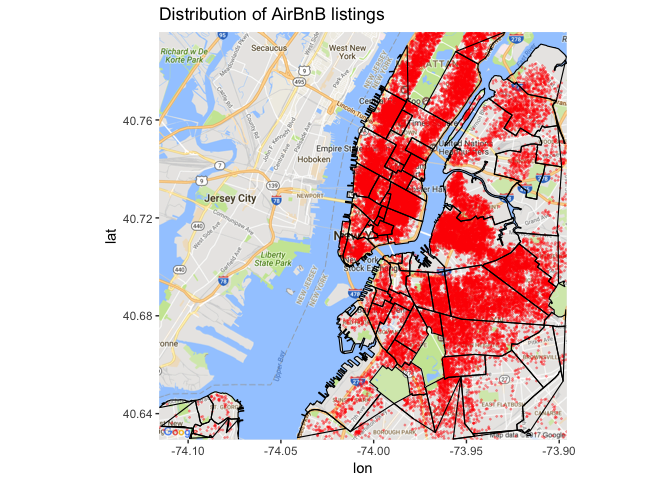
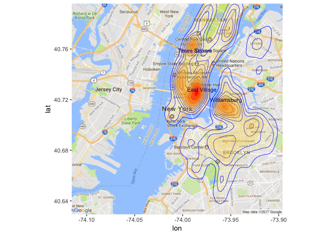
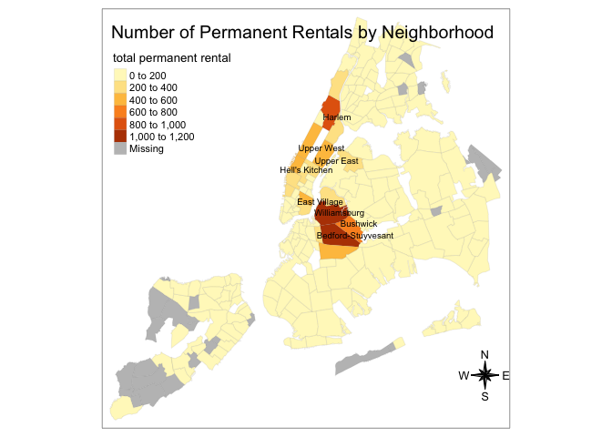
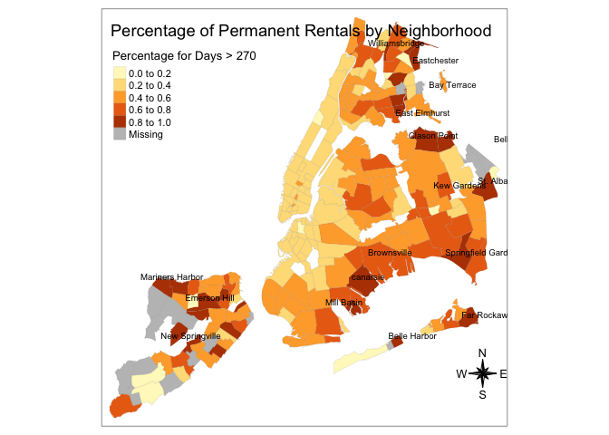
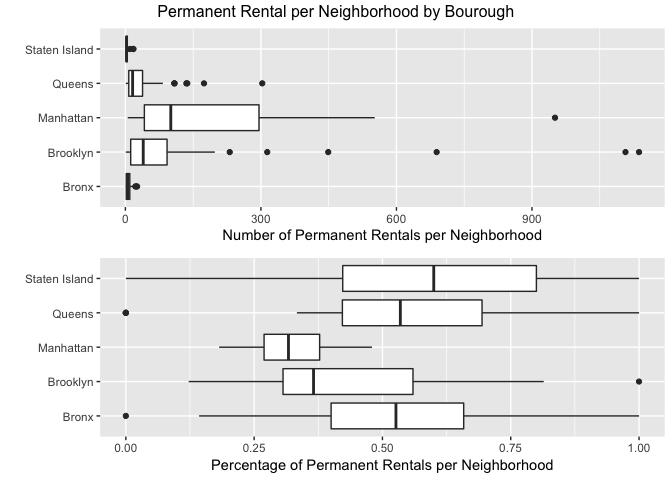
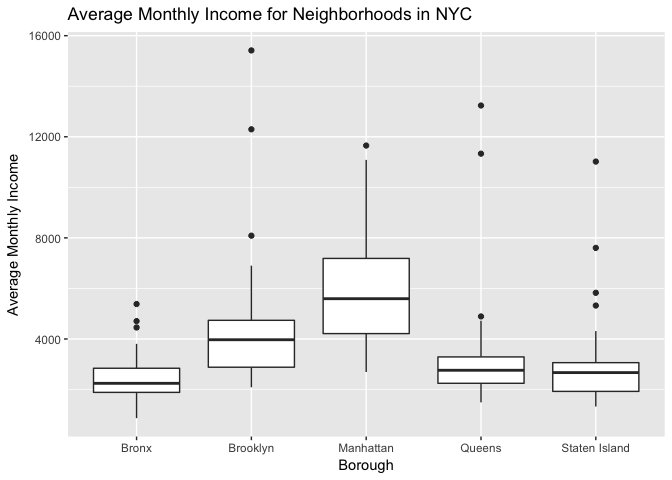
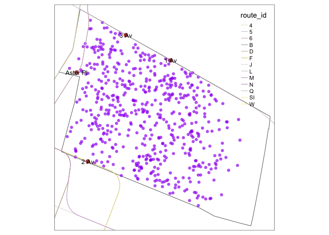
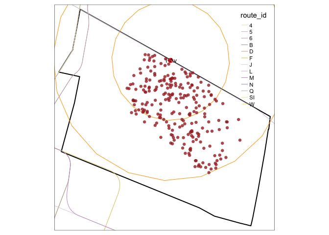
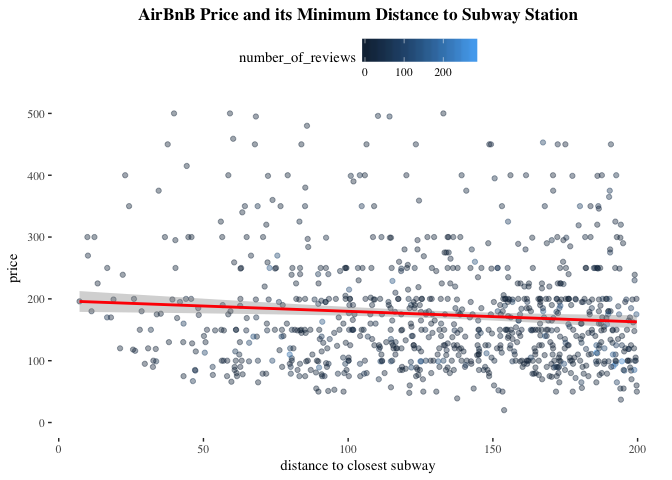

AirBnB in NYC_Youyang
================

1: Overall Location
========================

##### Map 1: location

Below is the map that shows where in New York City AirBnB listings are located:

##### Map 2: density and hotspots

Comparing the above map with the google map base map, we can tell that Times Square, East Village and Williamsburg are three hot spots that has highest density in terms of AirBnB listing.

2: Renting out your apartment vs. permanent rentals
=========================================================

First we need to set a standard and define what is "permanent rental". I used total rental days available &gt; 270, which is 3 seasons as the bar. To compare permanent rentals across neighborhoods, I drew two maps: 1st is marked using total number of permanent rentals in a neighborhood; 2nd uses the percentage of permernent rentals among total rentals in a neighborhood.

##### Map 3: Rental days &gt; 270:

From Map 3 we can clearly see that Williamsburg, Bedford-Stuyvesant and Bushwick (which are west Brooklyn) and East Village, Harlem have a large number of permanent rentals. However, we need to note that the large number of permanent rental might be due to the large size of neighborhood or the large total number of rentals in there. This is why we need a second map using percentage.

##### Map 4: rental &gt; 270 by percentage

In contrast to the previous map using absolute number of rentals, the distribution of high density permanent rentals are quite distributed using percentage approach.

We need to note that while this approach can reduce the problem of map 3, some of the neighborhoods are high in percentage because there are few rentals, which also happen to be permanent. For example, there is only one rental in Emerson Hill in Staten Island it happens to be permanent rental - this makes the percentage of permernent rentals in the neighborhood 100%, yet we cannot conclude this is a hot spot.

Therefore, I included some neighborhoods in the second tier (0.6 - 0.8) after sortinging the data and looking at the frequency and exact total number in the neighborhood so that the annotation now makes more sense.

##### Map 5: Scatter Plot by Color for 4 Season Rentals

Map 5 is a scatter plot of the distribution of all AirBnB listings, the color of which differes in 4 catergories: days avaiable smaller than 1 season, between 1 and 2 seasons, between 2 and 3 seasons, and above 3 seasons. The purpose of this map is that, since we selected 270 days as the criteria of "permernent rentals", this 4 cut-offs can facilitate us and make complement in studying distribution of rentals in terms of studying (semi)permenent rental, also it can show the robustness of choosing 270 days as standard.

##### Plot 1: Borough - Number of Permanent Rentals by borough

Let's look at the number of permanent rentals in a neighborhood in each of 5 boroughs. 

The above boxplot nicely shows us that in terms of total number of permanent rentals, Manhhatann stands out in terms of average and quantile range, followed by Brooklyn; in terms of percentage, Manhattant is the lowest, its range also is the smallest among the five.

##### Estimate Average Monthly Income from Permanent Rentals:

Using availability can over estimate the income since being available does not equal to being rented out; but they are positively correlated so it makes sense to use as an indicator, though lack accuracy. I set days per month = 30.

The average monthly income across the five boroughs is 1.69251e+12; the monthly income by neighborhood summarized in bourough can be shown in the boxplot below.

As can be seen from the plot, the average monthly income is highest in Manhantan, followed by Brooklyn. This is likely since the average rental price in Manhattan is higher. The quantile range in Manhattan is the largest too, this might be due to the days available have mediated the effect of high price.

3 Subway Access
=========

As shown in the project plan, while there is a large chance that the nearest subway station are in the neighboring neighborhood such as Greenwich Village, we simply this problem and exclude those cases.

##### East Village: distribution of AirBnB and Station

##### Create Buffer

Below I created 2 buffers (500m and 1000m) around 1 Ave Station. It is the closest subway station to neighborhoods in the dotted points.

##### Scatterplot to explore relationship between price and distance

Below is a scatterplot on the relationship between distance to closest subway and the price per night. The size of the points represent the number of reviews received, which is a measurement of the popularity of the rental and the days available.

From the plot we can see that there is a slight decrease in price as the distance to closest subway station increases, wchi manefests common sense.

