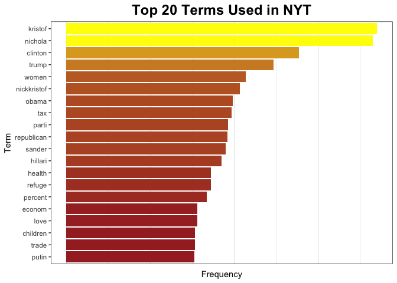
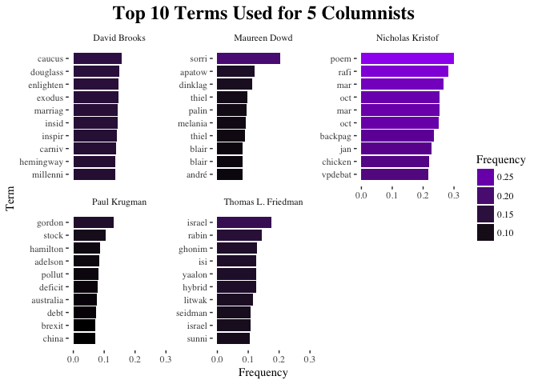
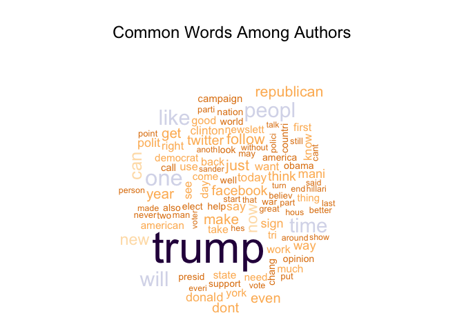
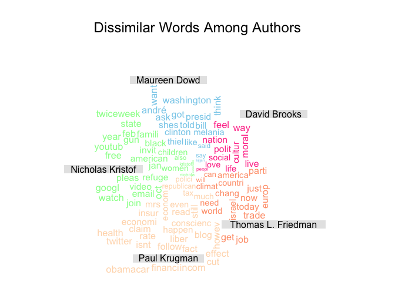
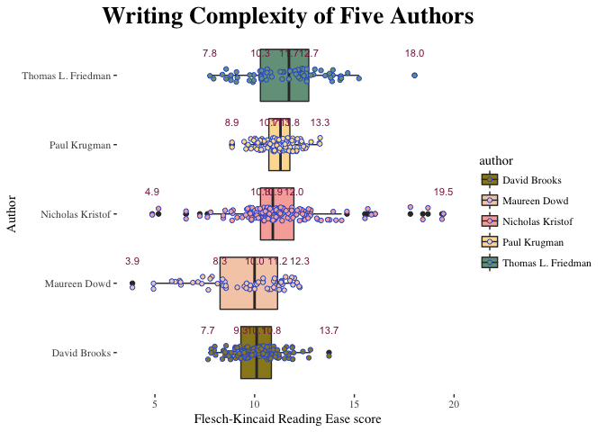
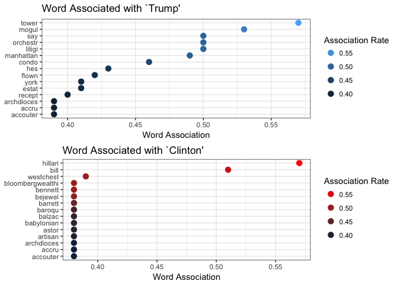
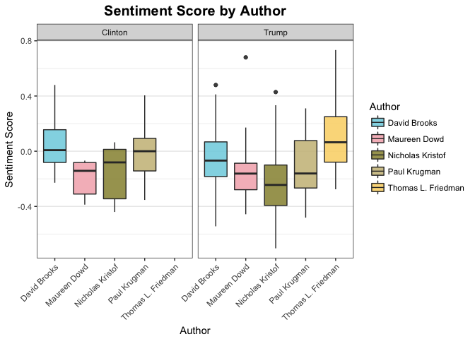
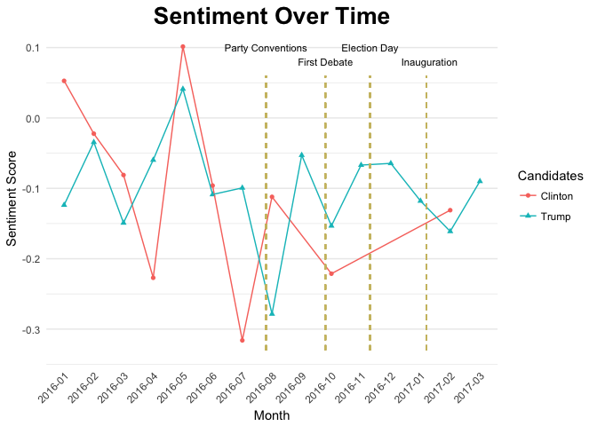

Text Analysis Youyang Cao
================

### I Comparing NY Times Columnists

To compare the five columnists articles, first we take a glimpse at the words that appear most in NYT as a whole. As can be seen from the bar plot below, election is a very popular topic: "Trump" and "Hilary" are the hottest words during the time period. Political, societal and economic topics are much mentioned, as can be seen from the terms: "tax", "party", "republican", "health", "refuge", "economy", "children", "trade".

Then we look at the top words of the five columnists separately. The plot below shows the most used words for the 5 columnists and the frequency of words respectively, weight by relative importance. We find that David Brooks most used words are "caucus", "douglass", "enlighten", "exodus", "marrig", which are largely on political and cultural topics. For Maureen Dowd, the most used words are "sorri", "apatow", "dinklag", "blair", which reveal her as a writer on American politics, popular culture and international affairs. For Nicholas Kristof, the top words are "poem", "rafi", "mar", "backkpag", "chicken", "vpdebat". For Paul Krugman, some top words are "gordon", "stock", "halmilton", "pollute", "deficit", "debt" and "brexit", which correspond to his background as an economist. For Thomas Friedman, some top words are "isreal", "ghonim", "isis", "hybrid", which show his interest in middle east issues.

The wordclouds below show the common and dissimilar words among the five columnists. Politics and election in particular, are the common topic, as can be seen from words "Trump", "republican", "campaign"; social media is also popular topic, shown from "facebook" and "twitter". Aside from the commonly mentioned topics, we can also detect the shared language usage patterns such as "will", "time", "people", "like", which can be of interest for linguistic study.

The word cloud for dissimilar words show that Nicholas Kristof talks more about racial and gender issues, as well as social media ("women", "black", "refuge", "gun", "youtube", "google"); Maureen Dowd is more concerned with politics, as shown in words such as "washington", "clinton", "melania"; David Brooks writes more about cultural and social issues ("cultur", "love", "moral"); Thomas Friedman writes more about middle east topics and international issues ("isreal", "europ", "world"); and Paul Krugman writes more on economics topics and public policies ("tax", "obamacare", "rate").

### II Lingustic Complexity of NY Times Columns

Based on the Flesch-Kincaid Reading Ease Score, we can see that despite the slight differences in score (Thomas Friedman ranks highest and David Brooks lowest), the average score are all around 10, which is college graduate level. The difficulty level for Paul Krugman has the smallest range, while the linguist complexity for Maureen Dowd can be more difficult than others in some cases (as low as 3.9). Nicholas Kristof has the largest range considering all articles (from 4.9 to 19.5).

### III Sentiment Analysis

First we look at the words that are associated with "Trump" and "Clinton". As shown in the plot, for "trump", the most associated word of interest are "tower", "mogul", "litigi", "condo", which targets at his wealth. As for "Clinton", those words are "westchest" , "bloombergwealth", "bennett", "babylonian", which of wider range in topics are related to current events and personal life such as her house at Westchester, being criticised as "whore of babylon", Clinton's superdelegate Michael Bennet, her pantsuits.

Second, I analyze how the tone of the texts differ between the two candidates and across the columnists. The boxplot below shows that the sentiment related to the two candidates are generally central or negative. David Brooks and Paul Krugman have slight positive attitudes in their articles towards Clinton, and negative sentiments towards Trump; Maureen Dowd has similar negative sentiment towards the two candidates; Nicholas Kristof has negative sentiment for Clinton, and a stronger negative sentiment for Trump. In contrast, Thomas Friedman did not mention Clinton, and has positive sentiment towards Trump.

Looking at the development of sentiment towards the candidates over time, we can see the pattern is affected by major political events. There is a plummet for the sentiment for Trump when he was nominated as the Republican party leader, and the sentiment for Clinton experienced an increase. The first debate rendered the sentiment for both candidate drop. Since the election day, the sentiment for Clinton kept increasing, while the sentiment for Trump experienced a drop during inauguration.

