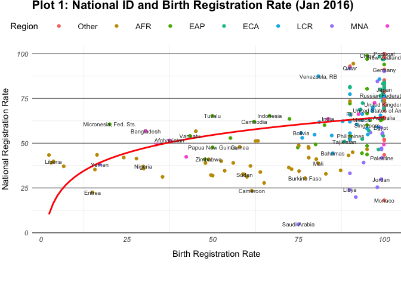
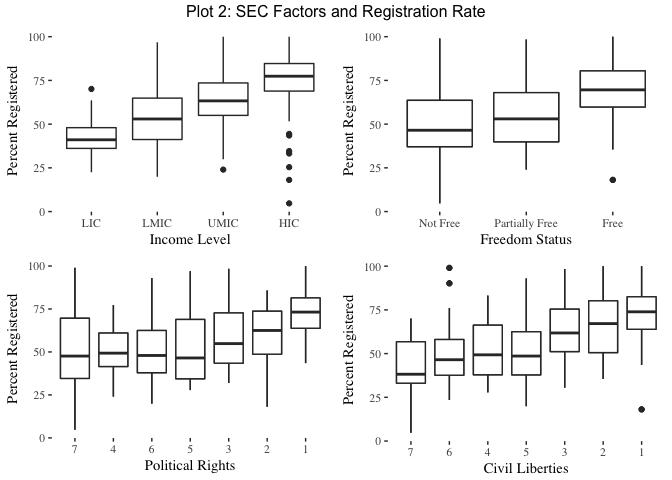
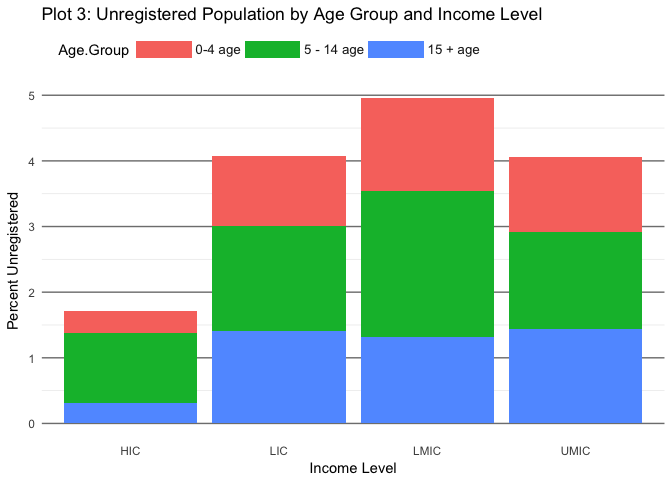
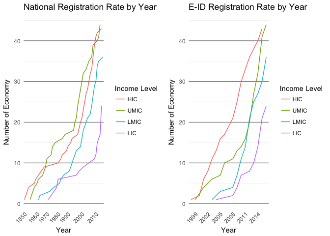

Population Registration
================

### (1) Global Pattern of Registration Rate

According to the World Bank, current government practice of population registration include: Birth registration, National Identification, Electronic Identification (E-ID), and Electronic Passport (E-Passport). Population registration plays an important role in citizen management and is becoming more and more common in most countries. For the majority of countries, National ID is not issued at birth, but is mandatory.

First let's gain a macroscoptic concept of the statistic and geographical distribution of Birth Registration rate and National Registration Rate from the plot below.

From plot 1 we can clearly see that countries with a higher birth registration rate tend to have a higher national registration rate. Regionally, African countries (AFR) have a large span in birth registration rate, and national registration rate are below 50% for the majority, which is extremely low. East Asia and Pacific countries also have a large variance in terms of birth registration rate, but are right skewed for both two indexes, which is due to the large coverage of this area. European and Central Asia (ECA) and Middle East and North Africa (MNA) have a very high birth registration rate, yet their national registration rate has a large standard deviation, and MNA countries are even lower, ranging from below 10% for Saudi Arabia to above 90% in Qatar.

Looking at the top left of the plot, we can tell that the top 10 succesful countries in population registration are: Hungary, Netherlands, Portugal, Denmark, China, Albania, Austria, New Zealand, Ireland, and Czech Republic.

### (2) Behind the figures: the role of social economic development level

The above regional distribution and difference in registration rate makes us wonder the reason behind. Aside from political factors, where China is a special case, it seems that the above regional difference represent developmental level of an economy.

Thus using income level, freedom status score, political rights score, and civil liberties score as social and economic development indicators, Plot 2 shows how the economic and politic development level of an economy is related to the percentage of population registered. Note that for political rights score and civil liberties score, 1 = best and 7 = worst.

The 4 boxplots show a pattern that as the income level, freedom status, political rights and civil liberties increase, the mean of population registration rate goes up.

### Some Evidence:

Plot 3 below is the percentage of unregistered population in three age groups and by 4 income levels.

The low percentage unregistered for high income countries can be explained by its low birth rate and its wide population registration implementation.

For lower middle and lower income level economies, the large percentage of unregistered population below age 5 indicates its high birth rate, as well as its ineffectiveness in implementing the registration, which might be due to lack of funding or government support.

So now we see the discrepancy in registration rate can be captured by the difference between developed and less developed countries. We cannot help questioning, since when did this discrepancy start?

### (3) Trace back: discrepancy not formed in one day

Social and economic development has a long history, whose accumulated effect has shaped the current setup of the world. So does population registration practice also follow the same development pattern? Do the current more developed countries also the pioneers of this practice? Can we define it as an indicator of social pregress?

Plot 3 shows that population registration started in 1850 and by now has a history of 167 years of history. Netherland is the first country to start the population registration practice, and this explains why we see in Plot 1 that it has the second highest National Registration rate worldwide.

We can tell from the graph that, current high income and upper middle income countries started with the practice 100 or more years earlier than the current lower middel income and low income countries. All countries experience a steady increase, and lower income countries particularly steep in the 2010s, but it still will take years to catch up, just as the time and effort that would be needed to catch up in social and economic development level.

### (4) Future: a replay?

Currently 80% of the economy have launched E-ID, though at different stages: 11% for identification only, 55% used for several e-services, and 10% used in multiple e-services including online services and digital signature. The future of population identification is E-ID. From the Plot 4 we see that such practice started in 1999, and while the high and upper middle income countries have taken the lead, the advantage in years is not too long. We are seeing developing countries catching up with the usage of E-ID, and is almost as widely used as the traditional ID shown in Plot 3. Due to infrastructure, technology advancement, funding and other issues, it would be hard to see all countries go hand in hand, yet the positive trend seems optimistic this time.
